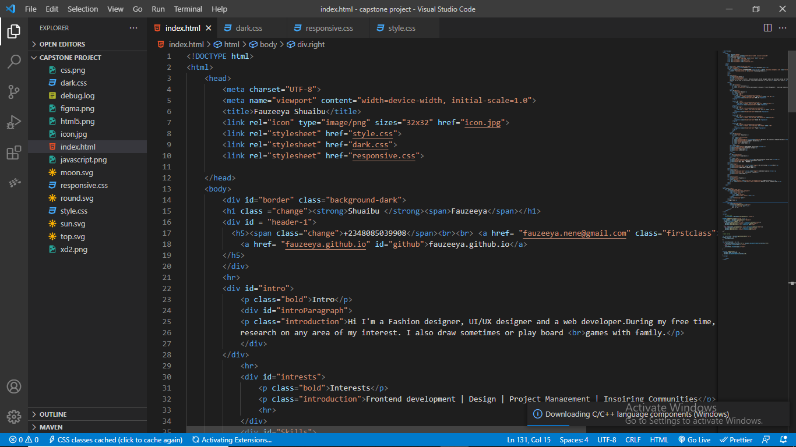
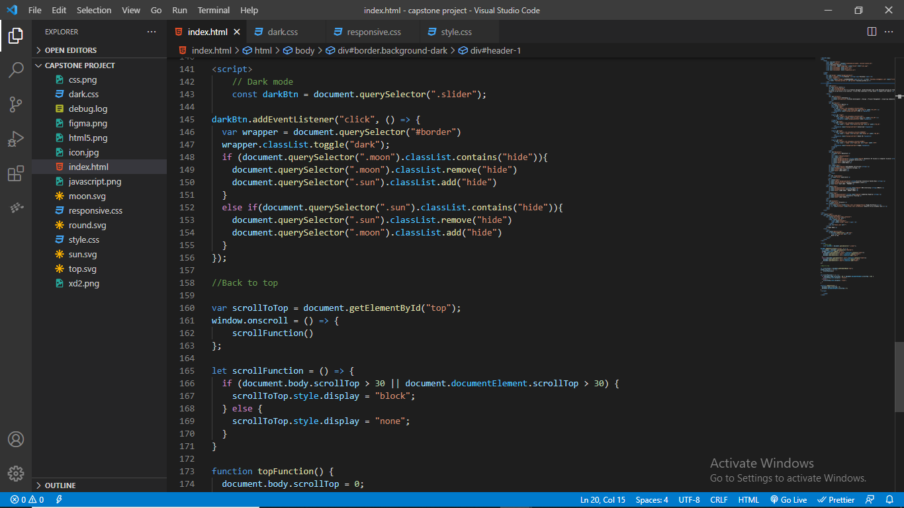
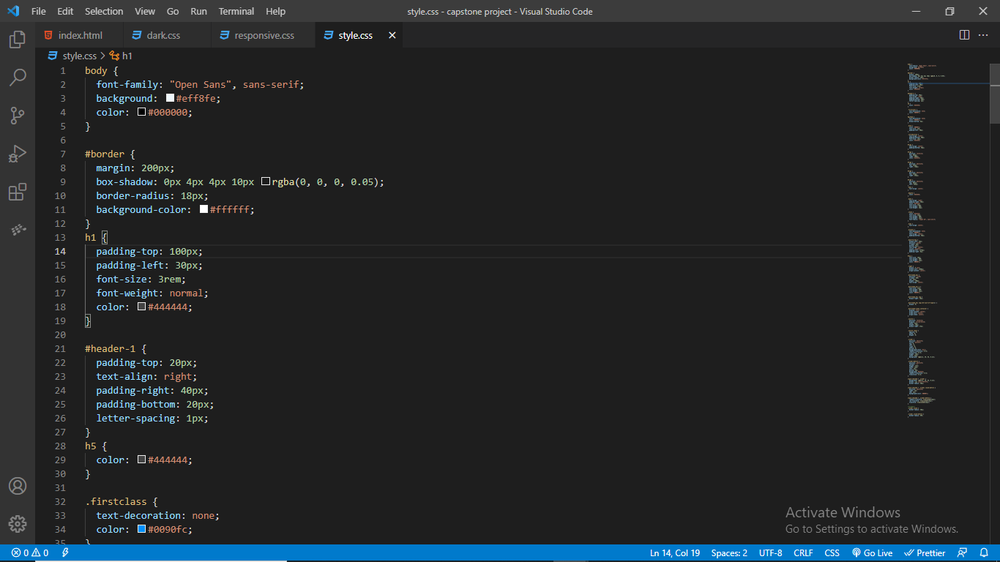
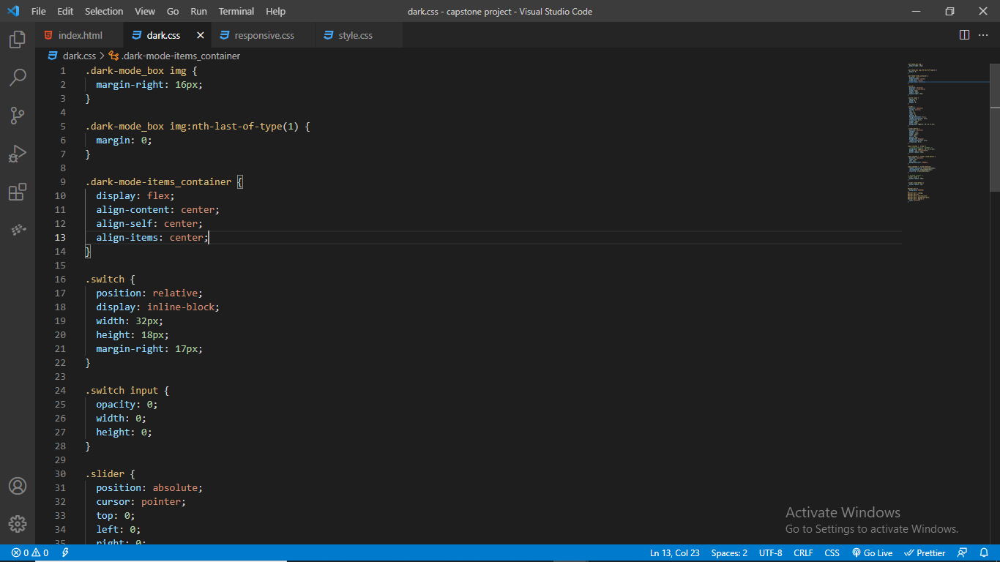
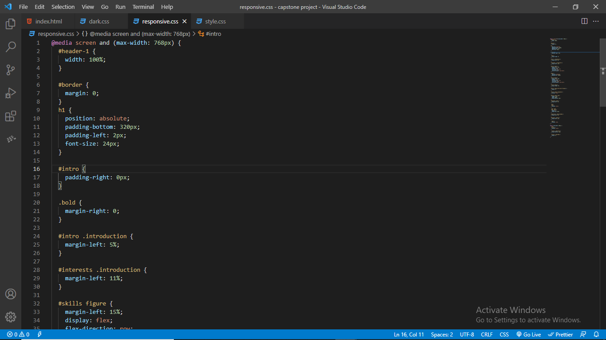

# A Documentation for Capstone project

> This project was used to test my knowledge on html, css and javascript after a training that lasted for two months.

## The HTML file

 

> I created a html file first and this basically contained the structure and contents of the page. The line of code below contains the head of the `index.html` file. It has the link to other stylesheets in it.

       `<html>
    	<head>
    	<meta charset="UTF-8">
        <meta name="viewport" content="width=device-width, initial-scale=1.0">
        <title>Fauzeeya Shuaibu</title>
        <link rel="icon" type="image/png" sizes="32x32" href="icon.jpg">
        <link rel="stylesheet" href="style.css">
        <link rel="stylesheet" href="dark.css">
        <link rel="stylesheet" href="responsive.css">
    	</head>`

> After writing the head, i moved on to the body of the `index.html` file.

       `<body>
        

        <h1 class ="change"><strong>Shuaibu </strong>Fauzeeya</h1>
        

          <h5>+2348085039908   <a href= "fauzeeya.nene@gmail.com" class="firstclass">Fauzeeya.nene@gmail.com</a>   
            <a href= "fauzeeya.github.io" id="github">fauzeeya.github.io</a>
        </h5>
        

        

        

            
Intro

            

            
Hi I'm a UI/UX designer and a web developer.During my free time,  i love to
            research on any area of my interest. I also draw sometimes or play board  games with family.

            

        

            

            

                
Interests

                
Frontend development | Design | Project Management | Inspiring Communities

                

            

            

                
Skills

                

                <figure id="fig1">
                    
                    <figcaption class="background-dark">HTML 5</figcaption>
                </figure>`

## The Script File

> I used the script tag to write an inline javascript code embedded in the `index.html` file

     ``

## The Stylesheets

> I created 3 stylesheets. `style.css` , `Dark.css` and `Responsive.css`

### Style.css

> This stylesheet contains the code for the website in lightmode.

     `body {
      font-family: "Open Sans", sans-serif;
      background: #eff8fe;
      color: #000000;
      }

      #border {
     margin: 200px;
     box-shadow: 0px 4px 4px 10px rgba(0, 0, 0, 0.05);
     border-radius: 18px;
     background-color: #ffffff;
     }
    h1 {
    padding-top: 100px;
    padding-left: 30px;
    font-size: 3rem;
    font-weight: normal;
    color: #444444;
    }

    #header-1 {
    padding-top: 20px;
    text-align: right;
    padding-right: 40px;
    padding-bottom: 20px;
    letter-spacing: 1px;
    }
    ......`

### Dark.css

> This stylesheet contains the code for the website in darkmode.

     `.dark-mode_box img {
      margin-right: 16px;
      }

      .dark-mode_box img:nth-last-of-type(1) {
       margin: 0;
       }

      .dark-mode-items_container {
       display: flex;
       align-content: center;
       align-self: center;
      align-items: center;
      }

      .switch {
     position: relative;
     display: inline-block;
     width: 32px;
     height: 18px;
     margin-right: 17px;
     .......`

### Responsive.css

> This stylesheet contains the code for the website responsiveness.

       `@media screen and (max-width: 768px) {
        #header-1 {
        width: 100%;
        }

        #border {
        margin: 0;
        }
        h1 {
        position: absolute;
        padding-bottom: 320px;
        padding-left: 2px;
        font-size: 24px;
        }

        #intro {
        padding-right: 0px;
        }

        .bold {
         margin-right: 0;
         }

        #intro .introduction {
        margin-left: 5%;
        }
        .....`
